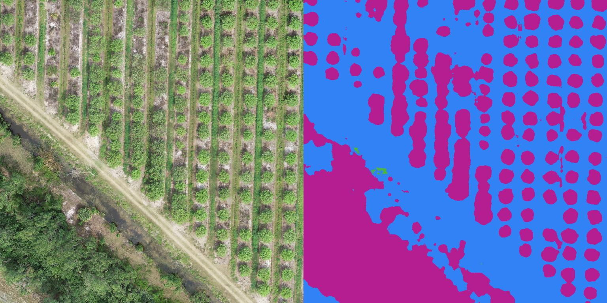

#### Semantic Segmentation - Drone Deploy Aerial Dataset

- Pytorch Lightning 
- https://www.dronedeploy.com/ 

Semantic segmentation implementation based on ```pytorch-lightning```. 

### Training 

using main.py with predefined data paths (TODO: add hparams)

```
python main.py

```

### Prediction

Prediction example at  

```
Inference.ipynb 

```

file 


### Results 

Example results on Unet, after 16 epochs, trained on 768x768 resolution.




# Todo's

- ENet
- pspnet 
- add hparams

